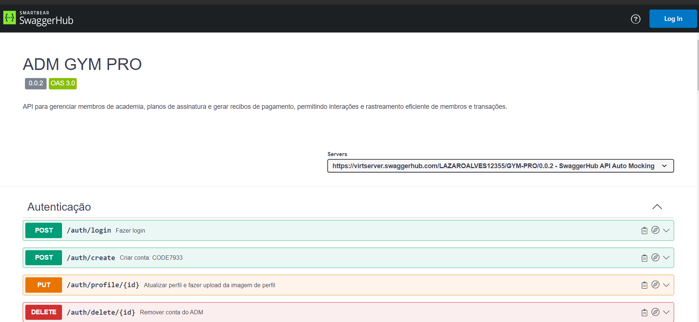

# 🏋🏼‍♂️GymPro API🏋🏼‍♂️

A Academia API foi criada para facilitar a gestão de academias, oferecendo controle completo sobre alunos, planos de assinatura, treinos e rotinas personalizadas. Com ela, é possível cadastrar e gerenciar alunos, criar e administrar planos de assinatura,

## Tecnologias Utilizadas:

- NestJS
- Prisma
- Supabase
- JWT para autenticação
- Cron Jobs
  
## Funcionalidades

- **Autenticação**: Sistema de login com JWT.
- **Gerenciamento de Alunos**: Cadastro, edição e exclusão de alunos.
- **Planos de Assinatura**: Criação e gestão de planos de assinatura (mensal).
- **Recibos de Pagamento**: Geração de recibos em PDF para pagamentos de assinaturas, fornecendo aos alunos um registro formal de suas transações.
- **Tarefas Agendadas (Cron)**: Verificação periódica para identificar alunos com mensalidades atrasadas.
 
### Funcionalidades da Documentação Swagger
A documentação da API está disponível através do Swagger. Você pode acessá-la no seguinte link:

- [Swagger UI](https://app.swaggerhub.com/apis-docs/LAZAROALVES12355/GYM-PRO/0.0.2)
- **Interface Interativa**: Teste os endpoints da API diretamente no navegador.
- **Informações Detalhadas**: Cada endpoint inclui detalhes como parâmetros de requisição, corpo da requisição, formatos de resposta e mensagens de erro possíveis.
- **Autenticação**: A documentação inclui informações sobre como autenticar utilizando JWT.

## Authors

- [@lazaroalvesr](https://github.com/lazaroalvesr)

## 🔗 Links

